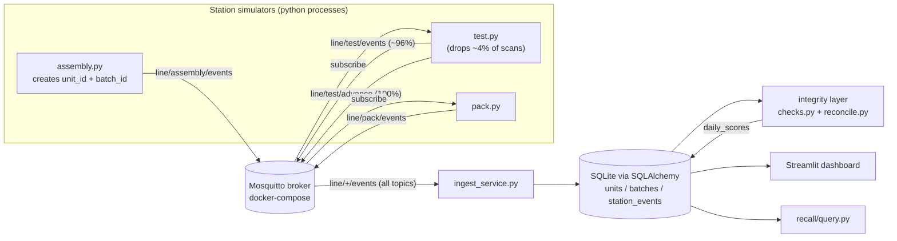

# Architecture

## Overview

Three station simulators publish scan events over MQTT as a unit moves
down the line. An ingest service subscribes to all of it and writes to
SQLite. An integrity layer runs checks against that data to catch gaps in
traceability, and a Streamlit dashboard visualizes the line in real time.

## Why MQTT between stations (not just station -> ingest)

Each station subscribes to the *previous* station's topic rather than
generating its own units. That mirrors a real line: Test only ever sees
units that physically left Assembly, and Pack only ever sees units that
left Test.

Test publishes two different things, which is the key to making the
injected defect realistic:

- `line/test/advance` -- a lightweight "this unit physically left Test"
  signal, published for *every* unit, 100% of the time. Pack subscribes to
  this, not to Test's scan-data topic, because a real conveyor keeps
  moving a unit even if its scanner missed the read.
- `line/test/events` -- the actual scan-data event (operator, cycle time,
  temperature, pass/fail), published for only ~96% of units. This is the
  injected defect: the *data point* is lost, not the physical unit.

Because those are separate topics, a dropped Test scan shows up in the
data exactly as it would on a real line: the unit still has Assembly and
Pack events, but a gap at Test -- which is what `integrity.checks.missing_scans`
is built to detect.

## Data model

- `batches` -- raw-material batch genealogy (batch_id -> material source)
- `units` -- one row per physical unit, links to its batch
- `station_events` -- one row per scan, indexed on `unit_id` and on
  `(unit_id, station)` so both the integrity checks and the recall query
  stay fast as the table grows
- `daily_scores` -- the computed traceability completeness score, one row
  per day it's run

## Why SQLite + SQLAlchemy

SQLite is enough for a local simulation and needs zero setup. Every query
goes through SQLAlchemy's ORM/Core layer, so moving to Postgres later is a
one-line change to `DB_URL` in `traceability/config.py` -- nothing else in
the codebase references SQLite directly.

## Process model

Everything except the MQTT broker is a plain Python process:

| Process | Role |
|---|---|
| `mosquitto` (docker-compose) | MQTT broker |
| `stations/assembly.py` | originates units |
| `stations/test.py` | tests units, drops ~4% (injected defect) |
| `stations/pack.py` | packs units |
| `ingest/ingest_service.py` | MQTT -> SQLite |
| `integrity/report.py` | run on demand (or on a schedule) to check + fix |
| `dashboard/app.py` | Streamlit UI |
